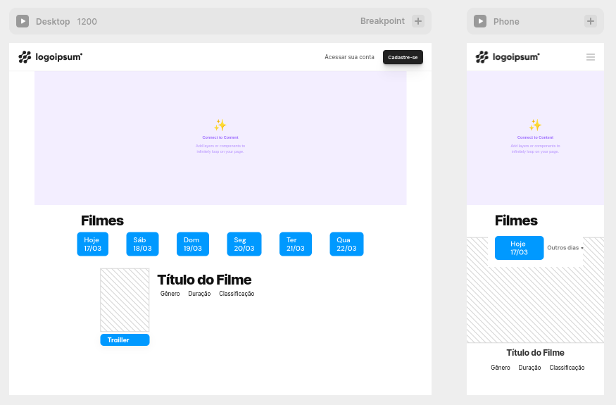

# W3cine
 Sistema web para vendas de ingressos de cinema

 ## Requisitos
1. **Autenticação de usuário:** os usuários devem ser capazes de criar contas e fazer login no sistema para comprar ingressos.

2. **Catálogo de filmes:** o sistema deve ter uma lista atualizada de filmes com informações como título, sinopse, elenco, classificação indicativa, horários e salas de cinema onde serão exibido.

3. **Compra de ingressos:** o sistema deve permitir que os usuários escolham o filme, horário e a quantidade de ingressos desejados para realizar a compra.

4. **Pagamento online:** o sistema deve ter integração com sistemas de pagamento online para que os usuários possam comprar ingressos.

5. **Confirmação de compra:** o sistema deve fornecer uma confirmação de compra para o usuário após a compra do ingresso.

6. **Envio de ingressos:** o sistema deve permitir que os ingressos sejam enviados para o e-mail do usuário ou armazenados na conta do usuário no sistema.

7. **Opções de cancelamento e reembolso:** o sistema deve ter uma política clara de cancelamento e reembolso, e permitir que os usuários solicitem o cancelamento de ingressos e o reembolso, se necessário.

8. **Gerenciamento de vendas:** o sistema deve permitir que o administrador do cinema possa gerenciar as vendas, visualizando relatórios de vendas, estoque de ingressos e informações sobre os usuários.

9. **Relatórios de vendas:** o sistema deve fornecer relatórios de vendas para os administradores do sistema, incluindo dados sobre os filmes mais populares, horários de pico e vendas por sala de cinema.

10. **Segurança de dados:** o sistema deve garantir a segurança dos dados dos usuários, incluindo informações de pagamento, e estar em conformidade com as regulamentações de privacidade de dados.

11. **Suporte ao cliente:** o sistema deve fornecer suporte ao cliente para ajudar os usuários com problemas de compra de ingressos ou outras questões relacionadas ao sistema.

12. **Integração com redes sociais:** é importante que o sistema tenha integração com redes sociais, permitindo que os usuários possam compartilhar informações sobre o filme e a compra de ingressos com seus amigos.

13. **Design responsivo:** o sistema deve ter um design responsivo, para que possa ser acessado por diferentes dispositivos, como computadores, tablets e smartphones.

## Diagrama de Classes

## Design
